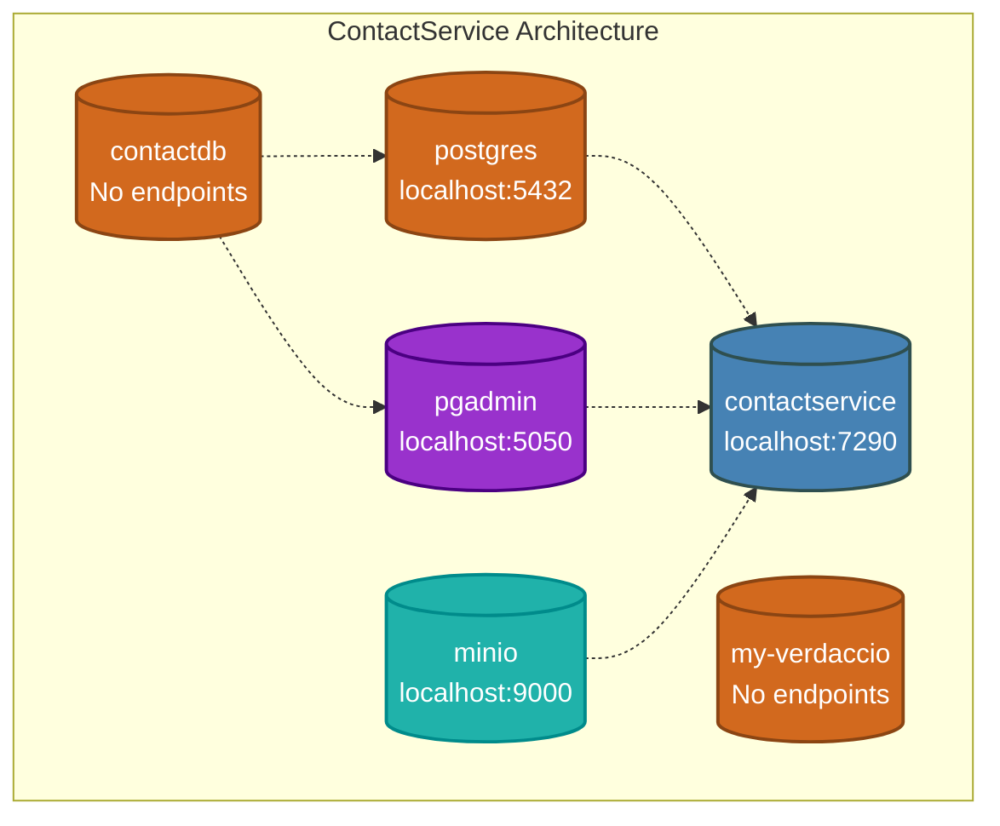
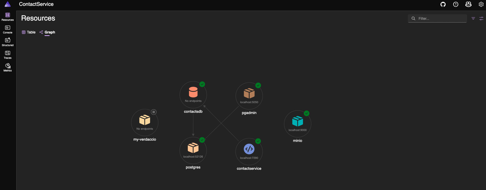
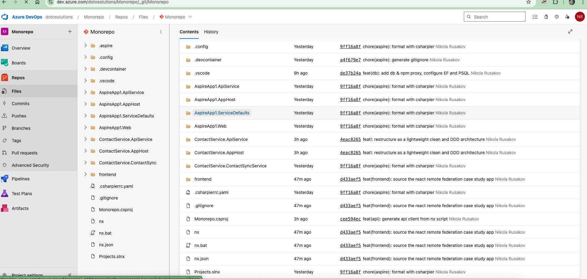

# Enterprise Full-stack Microsoft study - Azure, .Net, Angular, Code-first, DX practices 

## How to Run Solution

### Prerequisites
to run a monorepo solution, following needs to be installed: 
- [.Net](https://learn.microsoft.com/en-us/dotnet/aspire/whats-new/dotnet-aspire-9.4)
- [Aspire CLI](https://learn.microsoft.com/en-us/dotnet/aspire/cli/install)
- [Node.js](https://nodejs.org/en)
- npm


### Running the services

#### For Front End run 
- a React app Remote federation target `backoffice_core:serve:production` with 
```bash
nx run backoffice_core:serve --configuration=production --verbose
```

- a Host Angular app consuming Module Federation micro frontend, run with federation:serve:development with 
```bash
nx run federation:serve --configuration=development --verbose
```

#### For Back End run
- the default AppHost solution is configured, run in the projects root folder following
```bash
aspire run -w --debug # runs debug and watches for changes
```
- which 


## [`Contact.ServiceApiService`](./ContactService.AppHost/) code structure - App entrypoint code structure

### .Net Service Architecture Diagram



## [`Contact.ServiceApiService`](./ContactService.ApiService/) code structure
> Architecture Overview: Simplified Clean architecture with aspects of Domain Driven Design

Tree structure "Diagram"
```bash
.
├── Api
│   ├── ContactsModule.cs # - Carter Module, including Controller Logic and calling services
│   ├── ProductModule.cs # - Carter Module, Mocked controller
│   ├── UserModule.cs # - Carter Module, Mocked controller
│   └── WeatherForecastController.cs
├── appsettings.Development.json # - Dev env. Configuration, includes string
├── appsettings.json # - prod env. Configuration
├── ContactService.ApiService.csproj
├── ContactService.ApiService.http
├── Core # - Core, Clean Architecture -> represents Merged logic and domain related classes
│   ├── Card # Feature specific domain files
│   │   ├── Validators
│   │   │   └── VCardValidator.cs
│   │   └── ValueObjects
│   ├── Models # - simplified single name pattern containing records and other business logic
│   │   ├── Contact.cs
│   │   ├── Product.cs
│   │   └── User.cs
│   └── Services # service abstractions
│       ├── IContactService.cs
│       ├── IProductService.cs
│       └── IUserService.cs
├── Extensions.cs # - Extension containing DevOps MELT framework patterns (Metrics, Events, Logs, Traces)
├── Infrastructure -
│   ├── Data
│   └── Services
├── Program.cs # - Entry containing DI and Web server configuration
├── Properties
│   └── launchSettings.json
└── WeatherForecast.cs
```

## Back End Features
1. *[.Net Aspire Framework](https://learn.microsoft.com/en-us/dotnet/aspire/get-started/aspire-overview)*, Provider Agnostic distributed framework similar to [Java Quarkus](https://quarkus.io/), providing first-class citizen Developer Experience 
1. Infrastructure as Core in [ContactService.AppHost/AppHost.cs](./ContactService.AppHost/AppHost.cs) ensures seamless integrations during development, allowing running services in [VS Code Devcontainer](https://microsoft.github.io/code-with-engineering-playbook/developer-experience/devcontainers-getting-started/) / [Devbox](https://devpod.sh/) - as Development environment as Code
1. .Net Scalar OpenApi endpoints
  [https://localhost:7290/scalar/#tag/contacts/post/api/contacts](https://localhost:7290/scalar/#tag/contacts/post/api/contacts)
1. Plug-in Developer exprience extending the Front End practices. 
With that, it's possible to run [Verdaccio private npm proxy registry](https://verdaccio.org/) with the S3 compatible storage [Minio](https://www.min.io/) along with backend stack while being seamlessly integrated with port forwarding and such
1. FluentValidation - API requests validators using Fluent pattern, ensuring type safety and rule validation

## Front End Features
1. Module Federation - allowing Vertical Team Slices and decoupling of front end services
1. Vitest and [Vitest Browser](https://vitest.dev/guide/browser/) + [Playwright](https://playwright.dev/) testing - allowing running one runner utilising inline unit tests and multi framework stack, while improving overall test suite performance
1. Testing Library & MSW.js - running component and integration tests smoothly while testing real DOM elements including ARIA accessibility and component inputs
1. Contract driven development - using again Angular Testing Library, MSW.js and API generated client allows for independent development and testing features
1. Generated api and environment based configuration - build time env variables decide API URL with Http interceptor
1. Verdaccio - private package publishing and testing
1. exporting end to end testing reporting as Junit https://github.com/NikolaRusakov/Monorepo/blob/272a164c00f1822556adf31a624d00c5ebc4a20f/frontend/apps/frontend/project.json#L22- deploys directly to azure DevOps and allows for deep integrations with project management  


## Infrastructure Features
1. App Solution can be Primarily run in Docker for local development and seamlessly integrated with Azure DevOps, where the code base originally lives

1. Front End can be deeply integrated with .Net and other microservices in [Aspire App Host](https://learn.microsoft.com/en-us/samples/dotnet/aspire-samples/aspire-angular-react-vue/)